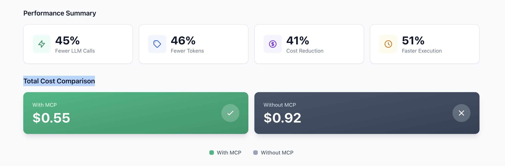

# CodeGraph

MCP (Model Context Protocol) server that builds and exposes a code graph via Neo4j, enabling LLMs to intelligently navigate and analyze codebases.

## Why CodeGraph?

LLMs are great at understanding code, but they lack **structural awareness**. They can read files, but they don't know how classes relate to each other, which functions call which, or what implements what.

CodeGraph solves this by building a **knowledge graph** of your codebase. Instead of searching through files, the LLM can directly ask: "Who calls this function?", "What classes implement this interface?", or "What would break if I change this?".

The result: faster navigation, fewer hallucinations, and more accurate refactoring suggestions.

## Supported Languages

| Language | Status |
|----------|--------|
| **Kotlin** | ✅ Available |
| Java | 🔜 Coming soon |
| TypeScript/Node.js | 🔜 Coming soon |

> 📢 Follow me on [LinkedIn](https://www.linkedin.com/in/chakib-houd-io/) to get notified when new languages are available!

### Benchmark Results

Tested on a Kotlin/Quarkus backend, CodeGraph reduces LLM calls, token usage, and costs by 40-50% compared to native file search tools (Glob/Grep/Read).



See the [full benchmark report](https://bikach.github.io/codeGraph/report/) for detailed metrics per scenario.

## Quick Start

### 1. Start Neo4j

```bash
docker-compose up -d
```

Access Neo4j Browser at http://localhost:7474 (Bolt: `bolt://localhost:7687`)

### 2. Build the MCP Server

```bash
cd mcp-server
npm install
npm run build
```

### 3. Index Your Project

```bash
cd mcp-server

# Index a project
npx tsx src/scripts/index-project.ts /path/to/project

# With options
npx tsx src/scripts/index-project.ts --clear --exclude-tests /path/to/project

# Dry run (parse and resolve only, skip Neo4j write)
npx tsx src/scripts/index-project.ts --dry-run /path/to/project
```

> 💡 **Using Claude Code?** Use `/codegraph:index` instead. See [Claude Code Plugin](plugin/README.md).

**Options:**

| Option | Description |
|--------|-------------|
| `--clear` | Clear the database before indexing. Use this to start fresh or re-index a project. |
| `--exclude-tests` | Exclude test files and directories (`*Test.kt`, `*Spec.kt`, `/test/`, `/tests/`, etc.). |
| `--dry-run` | Parse and resolve symbols without writing to Neo4j. Useful for validating your project parses correctly. |

### 4. Configure Claude Code

Add to your `.mcp.json` (project-level) or `~/.claude/claude.json` (global):

```json
{
  "mcpServers": {
    "codegraph": {
      "command": "node",
      "args": ["/absolute/path/to/codegraph/mcp-server/dist/index.js"],
      "env": {
        "NEO4J_URI": "bolt://localhost:7687",
        "NEO4J_USER": "neo4j",
        "NEO4J_PASSWORD": ""
      }
    }
  }
}
```

> **Note**: Leave `NEO4J_PASSWORD` empty if using the default Docker setup (`NEO4J_AUTH=none`).

## Claude Code Plugin

For the best experience with Claude Code, use the CodeGraph plugin with slash commands:

| Command | Description |
|---------|-------------|
| `/codegraph:setup` | Start Neo4j and prepare the database |
| `/codegraph:index` | Index your project into the graph |
| `/codegraph:status` | Check Neo4j connection and graph stats |

👉 See [plugin/README.md](plugin/README.md) for installation and usage.

## Available MCP Tools

| Tool | Description |
|------|-------------|
| `search_nodes` | Search classes, interfaces, functions by name or pattern |
| `get_callers` | Find all functions calling a specified function |
| `get_callees` | Find all functions called by a specified function |
| `get_neighbors` | Get dependencies and dependents of a class/interface |
| `get_implementations` | Find implementations of an interface |
| `get_impact` | Analyze impact of modifying a node |
| `find_path` | Find shortest path between two nodes |
| `get_file_symbols` | List all symbols defined in a file |

## Development

```bash
cd mcp-server

# Development with hot reload
npm run dev

# Run tests
npm test

# Type checking
npm run typecheck
```

## Docker Commands

```bash
# Start Neo4j
docker-compose up -d

# Stop Neo4j
docker-compose down

# Stop and remove data
docker-compose down -v

# Check logs
docker-compose logs -f neo4j
```

## License

MIT
