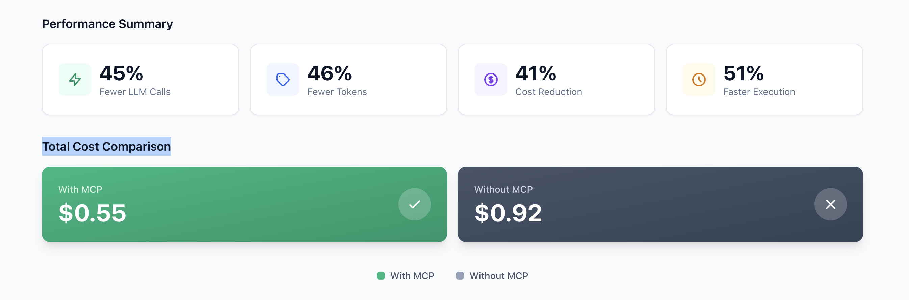

# CodeGraph

MCP (Model Context Protocol) server that builds and exposes a code graph in an embedded graph database (LadybugDB), enabling LLMs to intelligently navigate and analyze codebases. No server, no network hop — the graph is a single on-disk file that runs wherever your code lives.

## Why CodeGraph?

LLMs are great at understanding code, but they lack **structural awareness**. They can read files, but they don't know how classes relate to each other, which functions call which, or what implements what.

CodeGraph solves this by building a **knowledge graph** of your codebase. Instead of searching through files, the LLM can directly ask: "Who calls this function?", "What classes implement this interface?", or "What would break if I change this?".

The result: faster navigation, fewer hallucinations, and more accurate refactoring suggestions.

## Supported Languages

| Language | Status |
|----------|--------|
| **Kotlin** | ✅ Available |
| **Java** | ✅ Available |
| **TypeScript/JavaScript** | ✅ Available |

### Frameworks

CodeGraph is **framework-agnostic** — it analyzes the language structure, not the framework. It has been validated on real codebases built with:

| Language | Frameworks |
|----------|------------|
| **Java** | Spring Boot, JHipster, Android |
| **Kotlin** | Quarkus, Spring |
| **TypeScript/JavaScript** | NestJS, React |

> 📢 Follow me on [LinkedIn](https://www.linkedin.com/in/chakib-houd-io/) to stay updated on new features!

### Benchmark Results

Tested on a Kotlin/Quarkus backend, CodeGraph reduces LLM calls, token usage, and costs by 40-50% compared to native file search tools (Glob/Grep/Read).



See the [full benchmark report](https://bikach.github.io/codeGraph/report/) for detailed metrics per scenario.

## Quick Start

### 1. Build the MCP Server

```bash
cd mcp-server
npm install
npm run build
```

### 2. Index Your Project

The indexer and the MCP server share a single on-disk graph file, pointed to by `EMBEDDED_DB_PATH`.

```bash
cd mcp-server

# Index a project (re-indexing is idempotent: this project's data is replaced, others untouched)
EMBEDDED_DB_PATH=/path/to/graph.lbug npx tsx src/scripts/index-project.ts /path/to/project

# Exclude test files
EMBEDDED_DB_PATH=/path/to/graph.lbug npx tsx src/scripts/index-project.ts --exclude-tests /path/to/project

# Dry run (parse and resolve only, skip the graph write)
npx tsx src/scripts/index-project.ts --dry-run /path/to/project
```

> 💡 **Using Claude Code?** Use `/codegraph:index` instead. See [Claude Code Plugin](https://github.com/Bikach/claude-plugins/tree/main/codegraph).

**Options:**

| Option | Description |
|--------|-------------|
| `--exclude-tests` | Exclude test files and directories (`*Test.kt`, `*Spec.kt`, `/test/`, `/tests/`, etc.). |
| `--dry-run` | Parse and resolve symbols without writing to the graph. Useful for validating your project parses correctly. |

> Re-indexing always replaces the current project's data (scoped to its path), so there is no `--clear` flag — just run the indexer again.

### 3. Configure Claude Code

Add to your `.mcp.json` (project-level) or `~/.claude/claude.json` (global):

```json
{
  "mcpServers": {
    "codegraph": {
      "command": "node",
      "args": ["/absolute/path/to/codegraph/mcp-server/dist/index.js"],
      "env": {
        "EMBEDDED_DB_PATH": "/path/to/graph.lbug"
      }
    }
  }
}
```

> **Note**: Point `EMBEDDED_DB_PATH` at the same file you indexed into. The server reads it on each query, so re-indexing does not require a restart.

## Claude Code Plugin

For the best experience with Claude Code, use the CodeGraph plugin with slash commands:

| Command | Description |
|---------|-------------|
| `/codegraph:index` | Index your project into the graph |
| `/codegraph:status` | Check the graph file and its stats |

👉 See [Claude Code Plugin](https://github.com/Bikach/claude-plugins/tree/main/codegraph) for installation and usage.

## Available MCP Tools

| Tool | Description |
|------|-------------|
| `search_nodes` | Search classes, interfaces, functions by name or pattern |
| `get_callers` | Find all functions calling a specified function |
| `get_callees` | Find all functions called by a specified function |
| `get_neighbors` | Get dependencies and dependents of a class/interface |
| `get_implementations` | Find implementations of an interface |
| `get_impact` | Analyze impact of modifying a node |
| `find_path` | Find shortest path between two nodes |
| `get_file_symbols` | List all symbols defined in a file |
| `get_god_nodes` | Find the highest-degree nodes (system hotspots) |
| `get_module_overview` | Project map: domains, cross-domain dependencies, cycles |

## License

MIT
